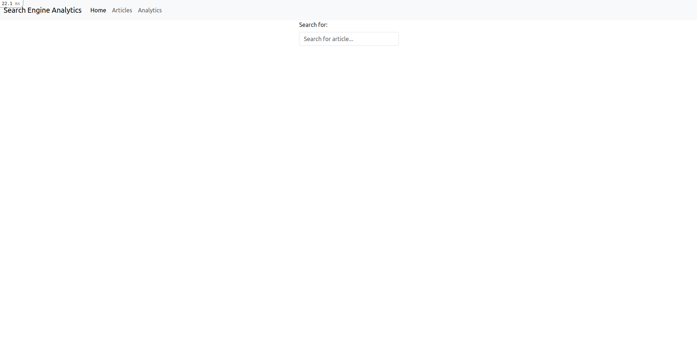
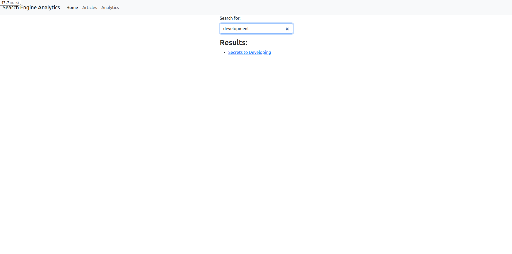
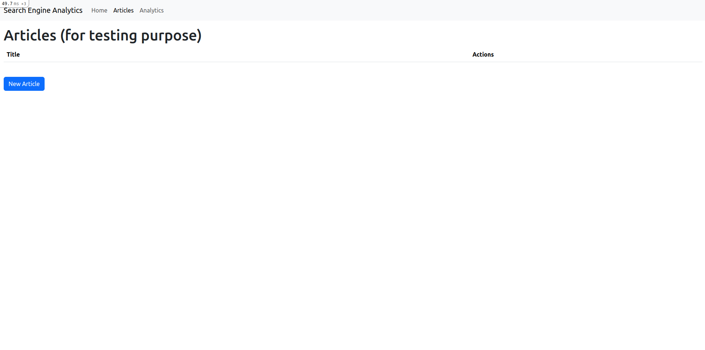
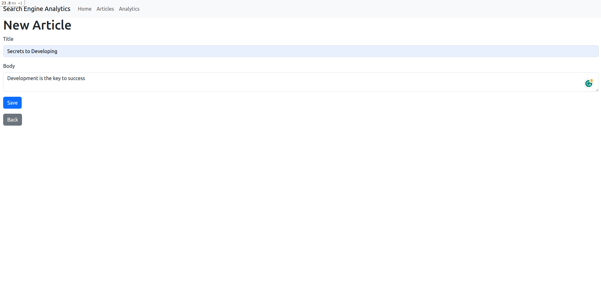
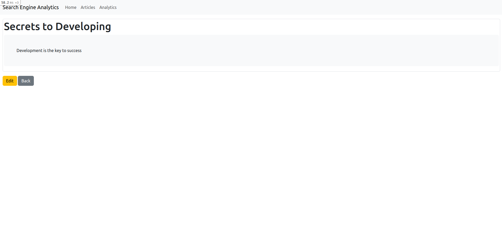
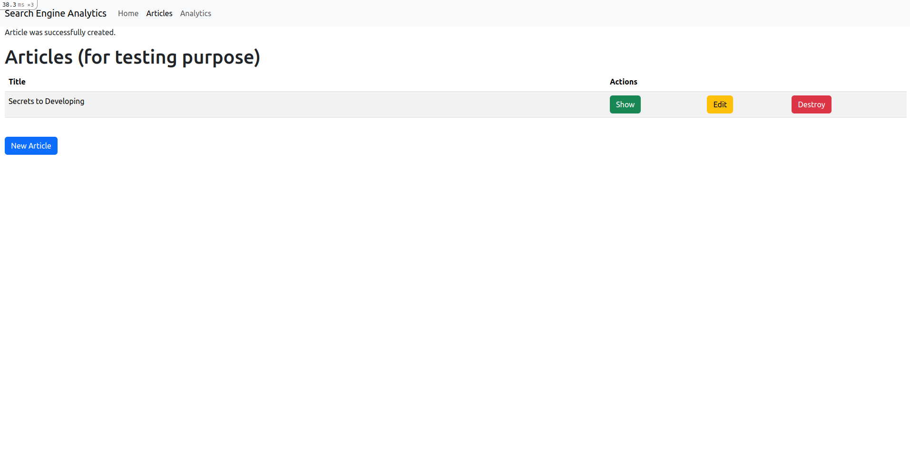
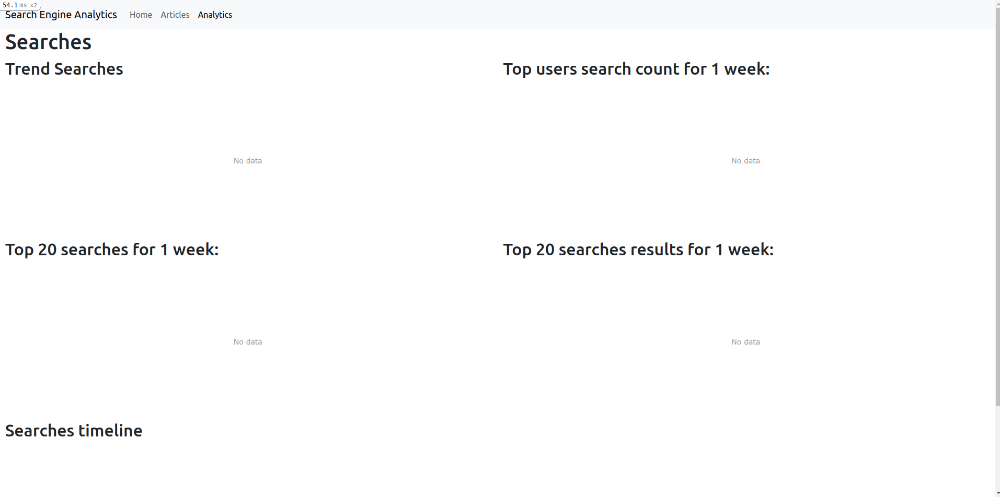
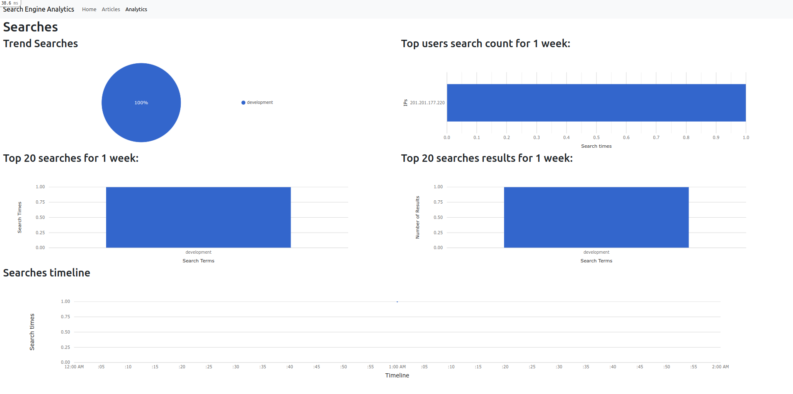

# Search Analytics

A realtime search box, where users search articles, and then to have analytics that
display what users were searching for.

## Application Demo
[Search Analytics Application](https://search-analytics-8586adffc5e9.herokuapp.com/)

## Environment

* Ruby 3.1.1
* PostgreSQL 14.10

## Prerequisites

- [Install Ruby V3.1.1](https://rvm.io/)
- [Install postgres 14.10](https://www.postgresql.org/download/linux/debian/)

## Installation

1. Run bundle install
    ```sh
      bundle install
    ```
2. Copy keys from `readme-assets/keys` to `config/credentials` directory
    ```sh
      cp readme-assets/keys/* config/credentials
    ```
3. edit credentials to match your own database credentials via, please set the `{editor_name}`
    ```sh
      EDITOR={editor_name} rails credentials:edit --environment development
    ```
   please apply the same for `test` environment
4. Run creating, migrating, seeding database
    ```sh
      rails db:{create,migrate,seed}
    ```
5. Run rails start
    ```sh
    rails s
    ```

Now the web server is up and available at http://localhost:3000

## Running unit/integration tests

Tests are running automatically before pushing, but in case manually run needed

```sh
rspec
```

## Navigating Through the Application
The application consists of 3 main views.
### Homepage
- You can search whatever article you want
  
- After writing search criteria, it should be searched and listed
  
### Articles
- For testing purposes (to perform CRUD)
  
- You can create articles through new article with title and body
  
- After creating new article you should be able to show and list articles
  
  
### Analytics Page
- It is for viewing search analytics at the beginning the search is empty
  
- After search has been made
  